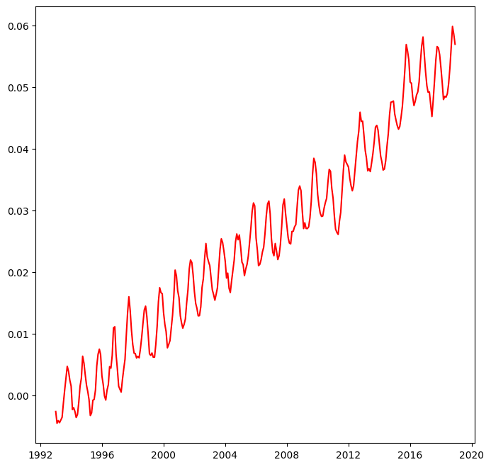
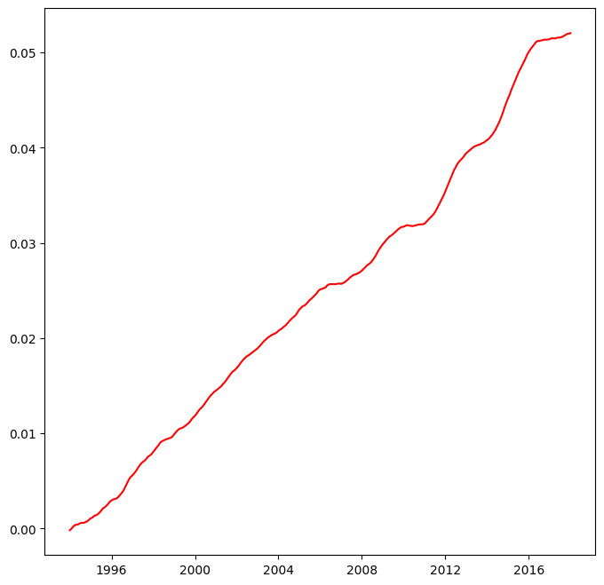
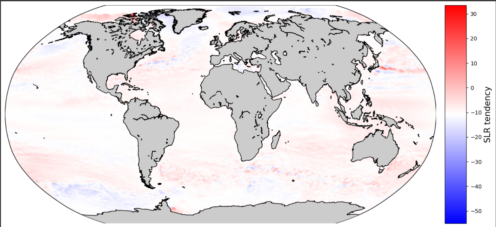
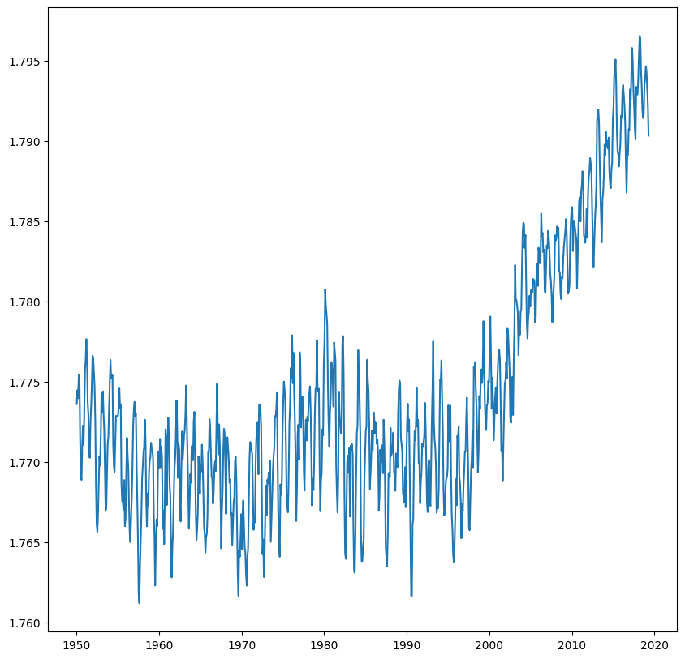
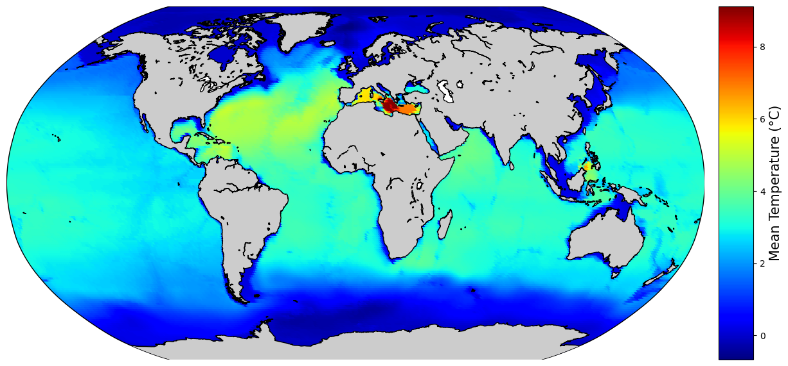
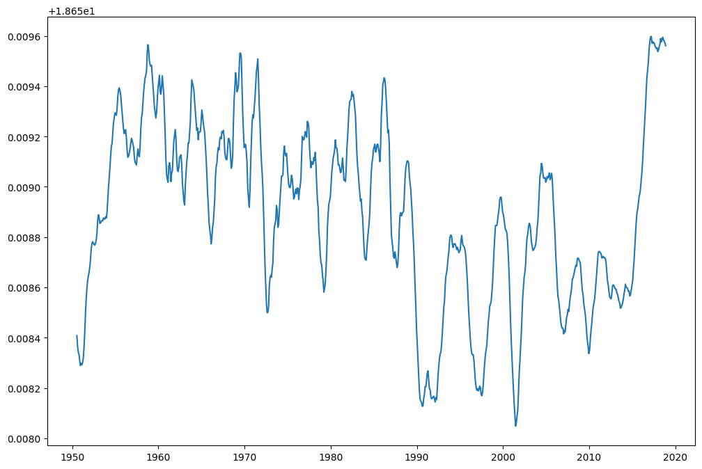
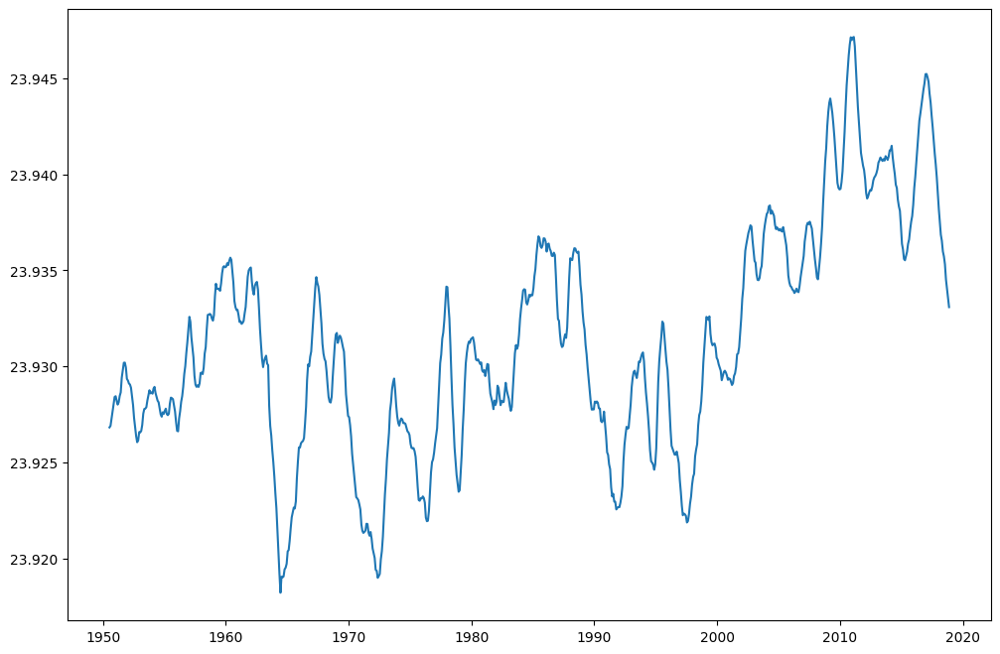
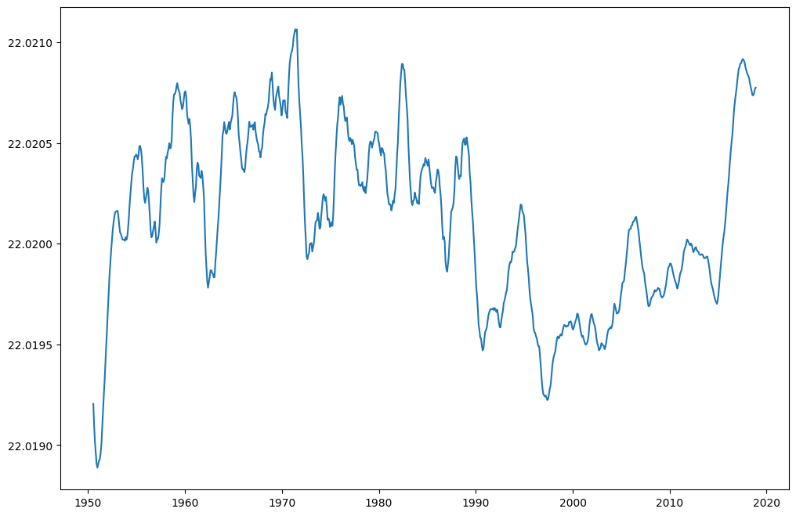
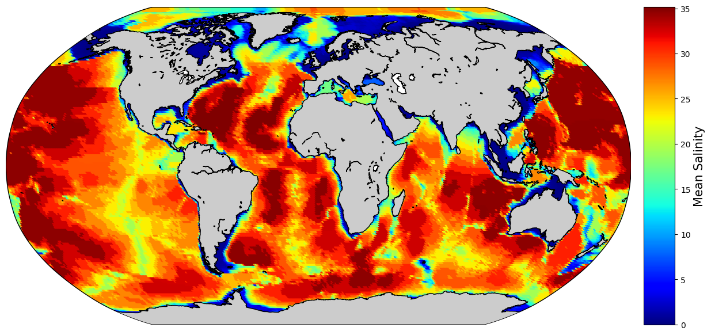

# Project 6: Ocean Warming Contribution to Sea Level Rise

## Overview
This repository contains our work on Project 6, which focuses on the contribution of ocean warming to sea level rise. This project is part of our Big Data & Cloud Computing class.

## Team Members
- Houda GHALLAB
- Yassine SAOUD
- Aymane HOUNA
- Pierrot LEVASSEUR

## Project Description
In this project, we aim to analyze and understand the impact of ocean warming and salinity, also known as thermosteric effect and halosteric effect respectively, on sea level rise. 
We tried to manipulate xarrays in order to extract significant information and view the effect of one phenomena on the other. The data corresponds to the period from 1993 to 2018.

# Sea Level Rise
We plotted the time series of SLA (sea level anomaly), by calculating its weighted average over the global volume of the ocean.
sea level anomaly (m/year)</img>
To better observe the seasonal (annual) evolation of SLA, we chose to apply a running average on the time series.
smoothed sea level anomaly (m/year)</img>
Next, we plotted the global map of sea level rise trend.
slr trend</img>

# Temperature
One of the main factors contributing to the increase of sea level is the thermostatic effect.
We first plotted the time series of the temperature the same way we did with SLA.
ocean temperature (C/year)</img>
ocean temperature (C/year)</img>
Next, we viewed the global average temperature of the ocean.
ocean temperature</img>

# Salinity
Finally, we move to the halosteric effect.
We plotted the smoothed time series of the salinity the same way we did with SLA.
 global salinity</img>
salinity under 100m of depth</img>
salinity (1000-3000m)</img>
Finally, we viewed the map of the average global salinity.
</img>

