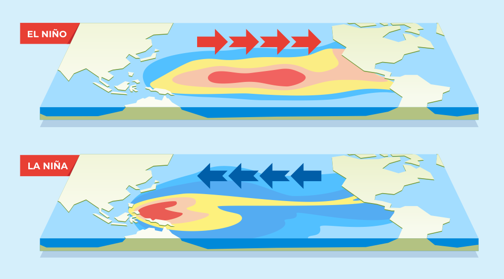
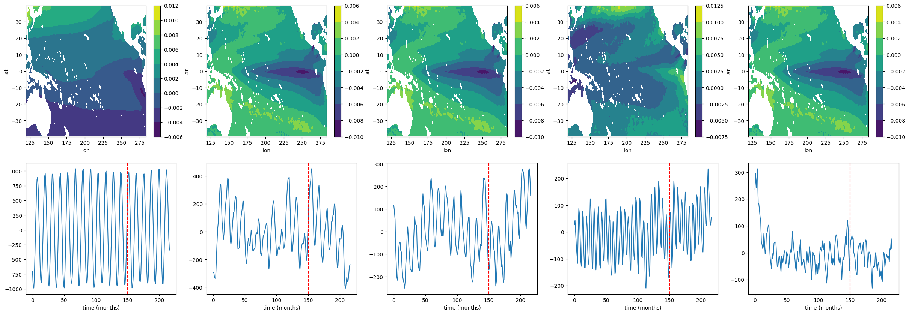

# Project 01 - El Niño and La Niña

## Introduction
In the project, we study the daily mean SST in the equatorial Pacific. The corresponding time series is given below. The high SST values correspond to Nino events and the low SST to Nina events. Study the spatial distribution of SST and SSH in these 2 extreme situations.

## Project organization
 * [Code implementation](./project01.ipynb): Notebook contains Python code for loading the SST data from Google Cloud, preprocessing in the appropriate format, and implementing the algorithms (PCA, Multiple Linear Regression).
 * [Presentation](./project01.ppt): Brief piece showing the gained results.

## Result Demo

## Contribution
Le Kim NGUYEN

Le Nam Hieu NGUYEN

Julien Pasquiou

Clotilde Faure